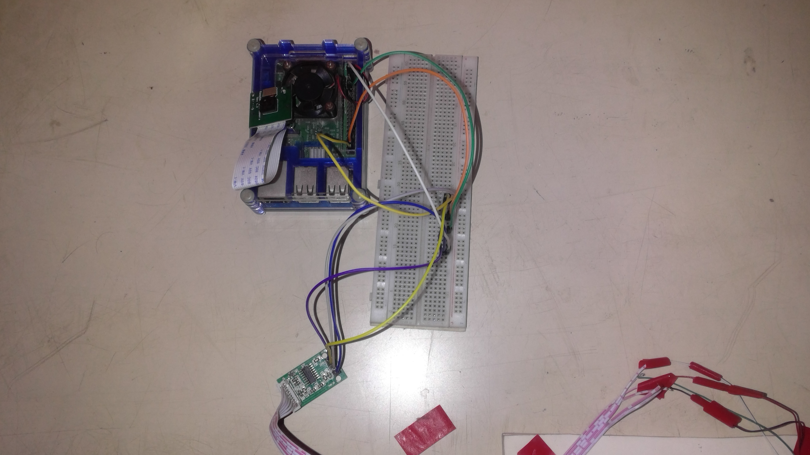
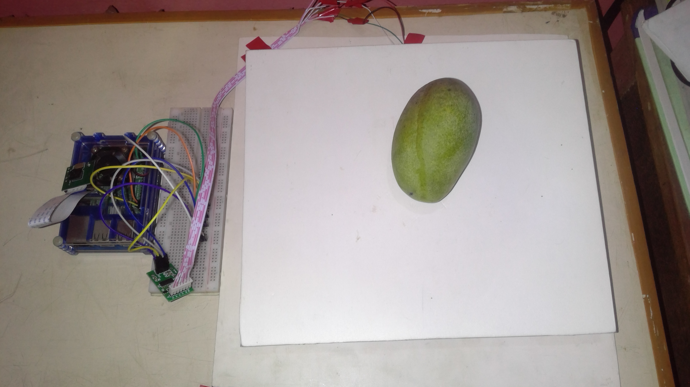
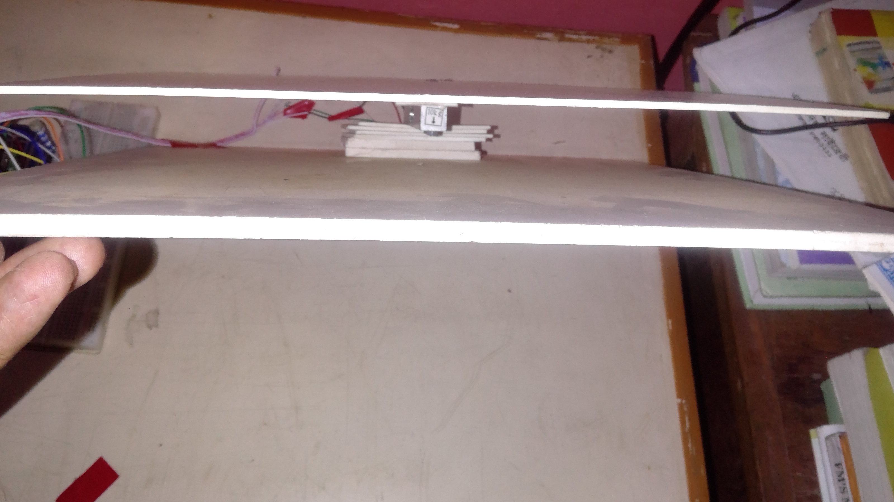
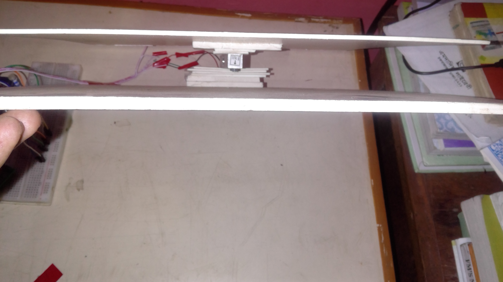
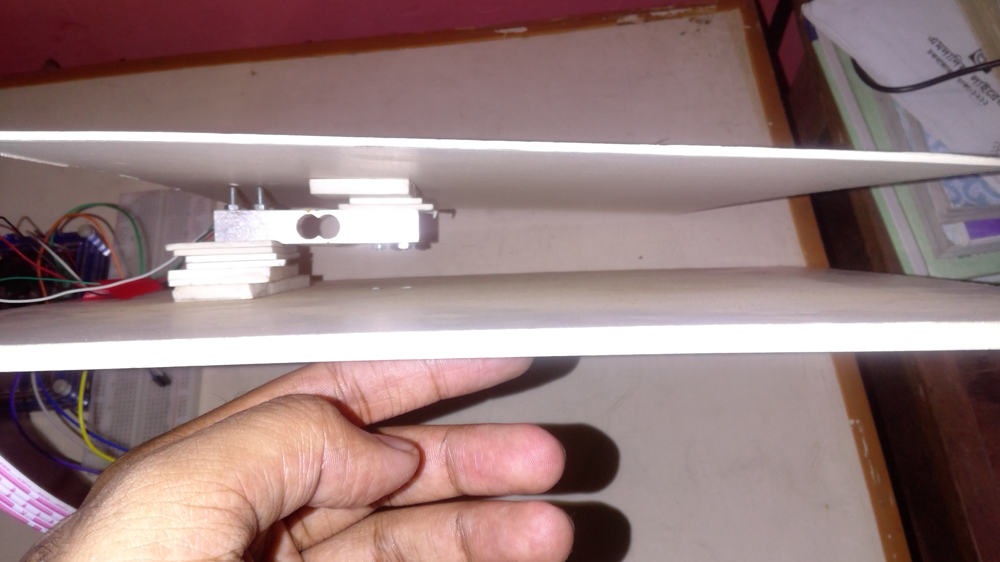

## SmartWeight : RaspberryPi-HX711 based Digital Weight Machine with Object Detection

### Short Description

This project aims to develop a smart system that utilizes an HX711 module and a load cell for precise weight measurement and a camera integrated with a Convolutional Neural Network (CNN) model for object detection. The system will allow users to place objects on the load cell, measure their weight accurately, and use the camera to identify the object. The detected object's unit price will be retrieved from a database and multiplied by the measured weight, resulting in the total price. The system will provide real-time price calculations, ensuring accurate and efficient pricing for various objects. Users will be able to view and manage the unit prices stored in the database, enhancing flexibility and adaptability. 

### RaspberryPI - HX711 Module - Load Cell Connection

Source : https://tutorials-raspberrypi.com/digital-raspberry-pi-scale-weight-sensor-hx711/

### Snaps

|||
|-----|---|
|| |
|| |
|| |
