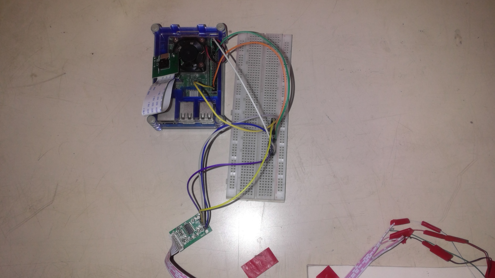
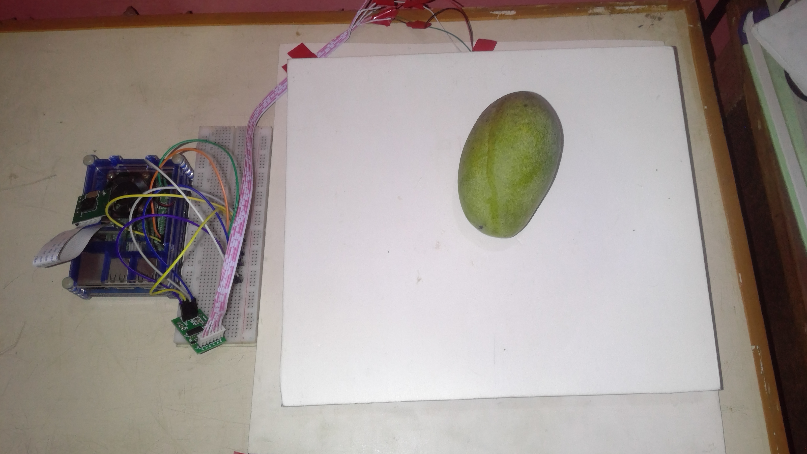
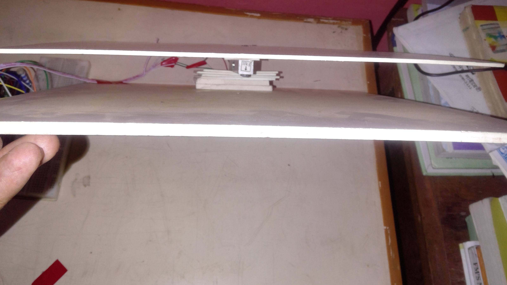
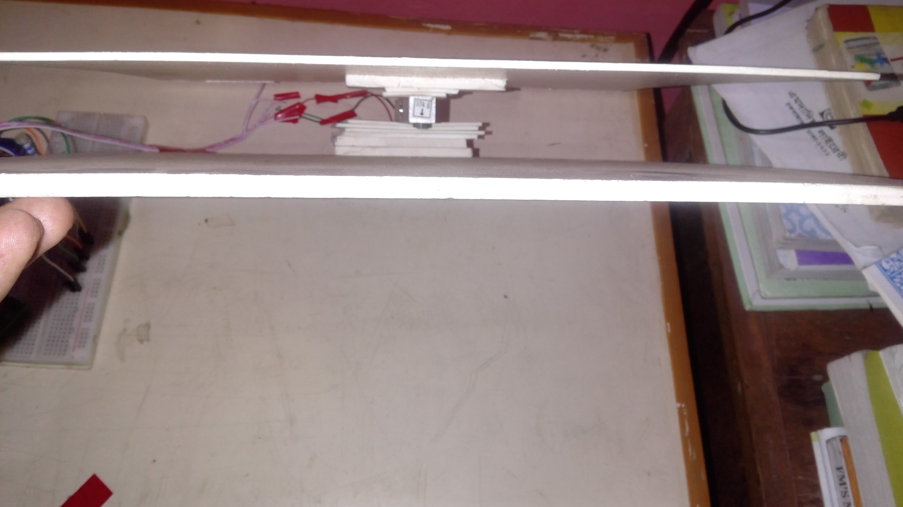
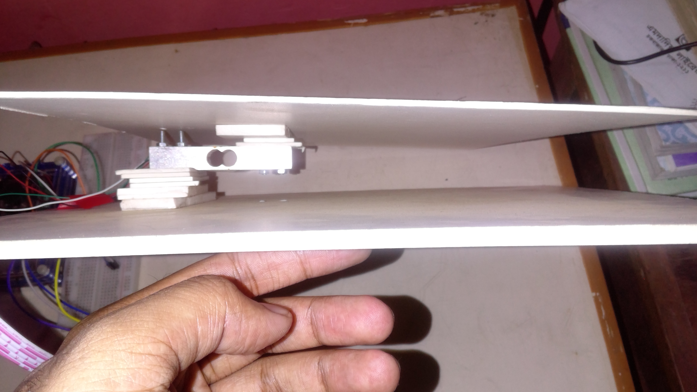

## SmartWeight : RaspberryPi-HX711 based Digital Weight Machine with Object Detection

### RaspberryPI - HX711 Module - Load Cell Connection

Source : https://tutorials-raspberrypi.com/digital-raspberry-pi-scale-weight-sensor-hx711/

### Snaps

|||
|-----|---|
|| |
|| |
|| |
